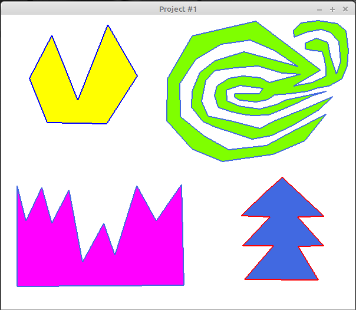

# cgis-course-uoi

A repository for the OpenGL project of the Computer Graphics and Interaction Systems course.

## About
OpenGL application for polygon drawing, coloring, clipping and 3D extrusion.

## Requirements

 - [x] Main window & Menu with Exit option
 - [x] Polygon drawing action
 - [x] Check for self-intersecting polygons
 - [x] Polygon triangulation (example code was provided by instructor)
 - [x] Polygon coloring (edges + fill)
 - [x] Polygon clipping using the Hodgeman-Sutherland algorithm
 - [x] Extrusion in 3D (Developed by [czonios](https://czonios.github.io/))

__Bonus__ 
 - [x] Different extrusion length per polygon
 - [x] Vertex move with check for self-intersecting polygons

## Developers
 - [George Z. Zachos](https://gzachos.com)
 - [Christos Zonios](https://czonios.github.io/)

## Screenshots

## Note
Currently I have no time to write a proper README.

## License
[GNU GENERAL PUBLIC LICENSE Version 2, June 1991](LICENSE)
